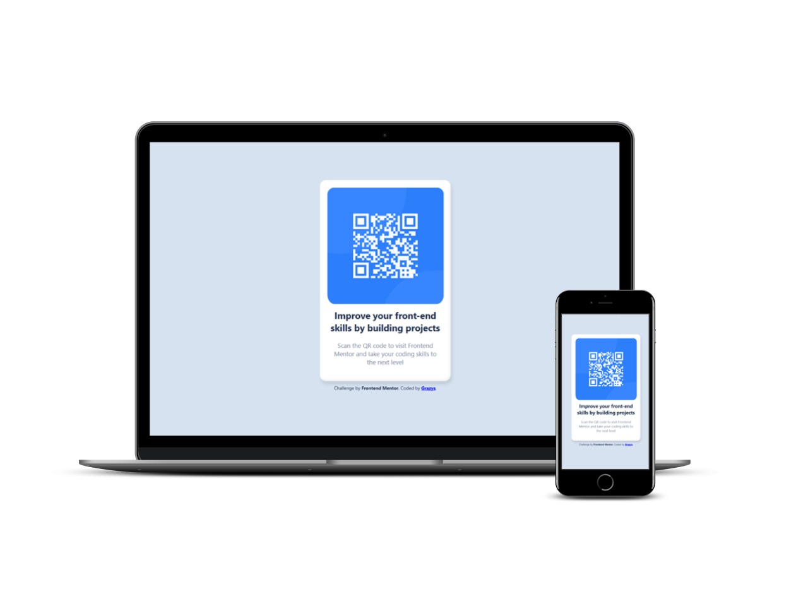

# 🌐 QR Code Component
Enhancement Challenge on Frontend Mentor, Solution by Grazy =)
 Frontend Mentor challenges help you improve your coding skills by building realistic projects. 

## Table of content
- [Overview](#overview)
  - [Screenshot](#screenshot)
  - [Links](#links)
- [My process](#my-process)
  - [Built with](#built-with)
- [Author](#author)
 
 

## Overview
### 📸 Screenshot
Mockups, notebook e smartphone.

This is my solution: ⇧

.

.
# 💻 For desktop:

.

# 📱 For mobile:

</body>

## 🔗 Links

- Solution URL: [qr-code-component.com](https://grazysss.github.io/QR-Code-component/)

## 💡 My process
- Build with:
  - HTML
  - CSS
  - Flexbox
  - Figma
  - Git 
  - Github

## 💞 Author
- WebSite: [Currículo-Grazys on Github](https://grazysss.github.io/curriculo-grazy/)
- Twitter: [@sz_grazys](https://twitter.com/sz_grays)
- Github: [SIGAM-LÁ!!!](https://github.com/grazysss/)

.

.

.
# FINISH!!! ツ